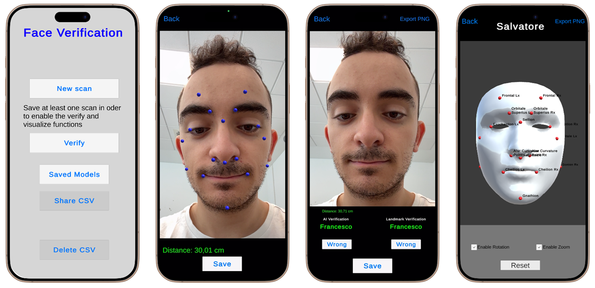
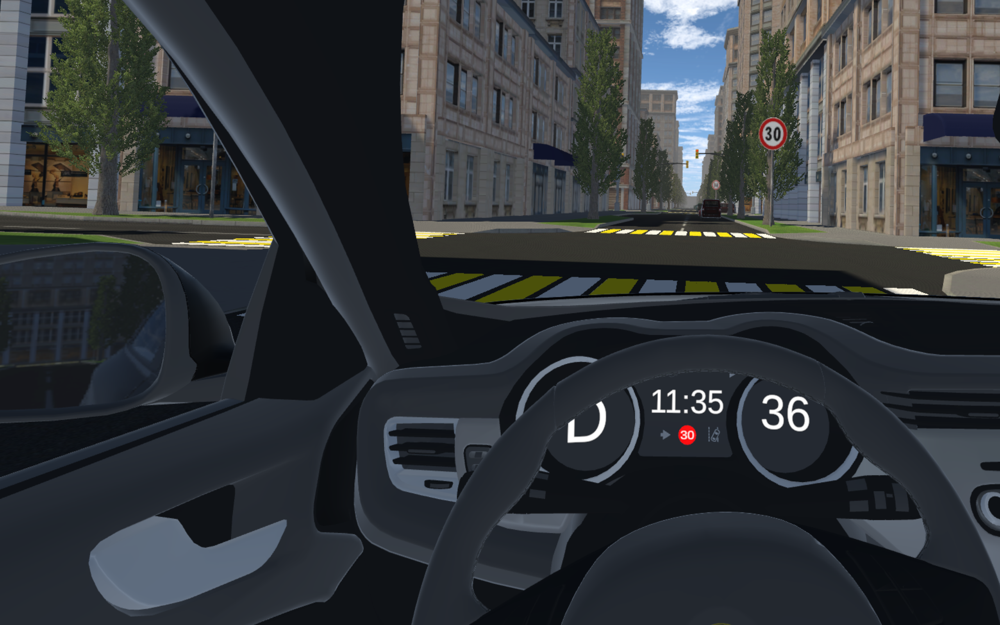
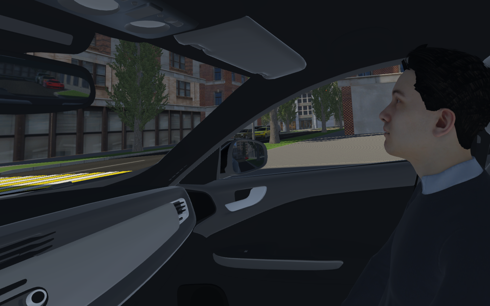
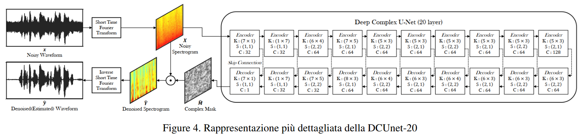
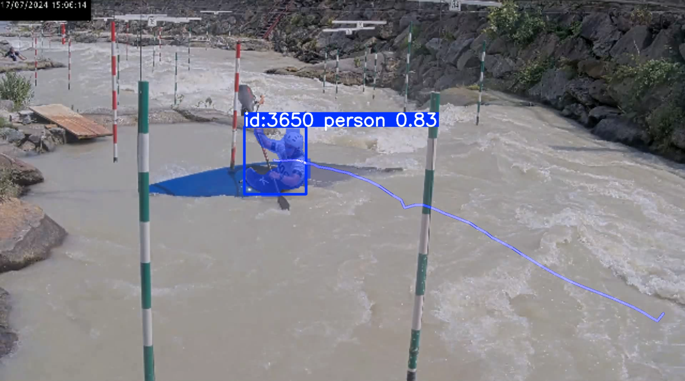
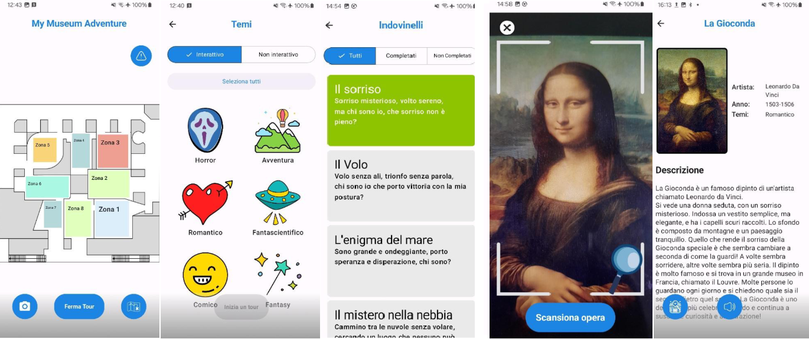
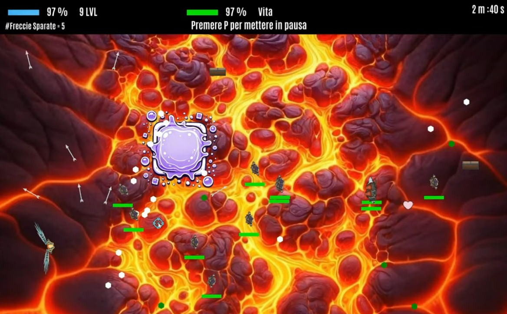
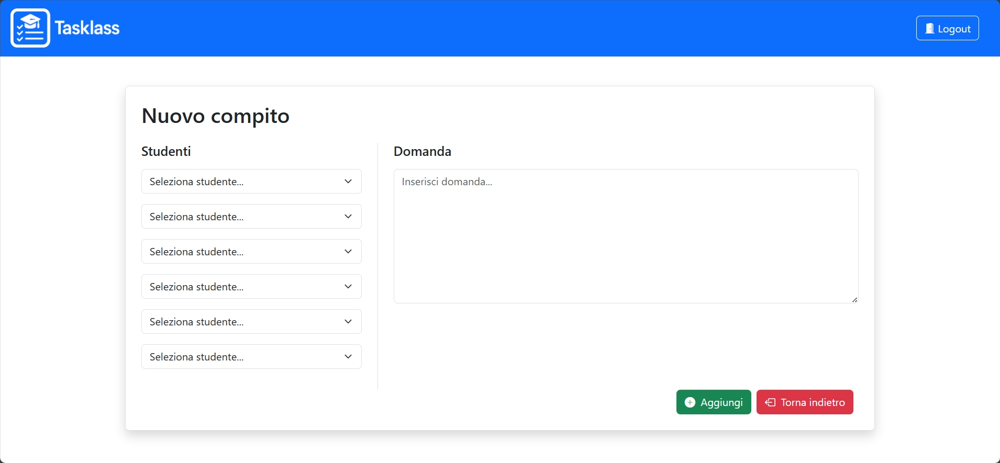

 

 

 

> [!NOTE]
> <i>Il README di questo profilo è attualmente in costruzione. Nel frattempo, puoi dare un'occhiata ai progetti a cui ho contribuito qui sotto!</i>

## ℹ️ Chi sono!

Studente magistrale in Ingegneria Informatica al **Politecnico di Torino**, specializzato in **Computer Graphics & Multimedia**.

I miei principali interessi e aree di focus:
- 🥽 **Extended, Augmented & Virtual Reality**
- 🎨 **Grafica 3D & Modellazione**
- 👁️ **Computer Vision & Elaborazione delle Immagini**
- 🎵 **Elaborazione Audio & Signal Processing**
- 🤖 **Machine Learning applicato a Vision e Multimedia**

*Attualmente sto completando una tesi magistrale sulla valutazione degli stati cognitivi in ambienti XR tramite interfacce cervello-computer attive e passive.*

---

## 🚀 Progetti in evidenza

- [👀 Facial Verification — Landmark Geometrici vs. Embedding Neurali](#facial-verification)
- [🚗 DriveAcademyVR — Simulatore VR di Scuola Guida](#driveacademyvr)
- [🎵 Riduzione del Rumore in Canzoni Senza Dati di Training Puliti](#noise-reduction)
- [📹 Canoa Slalom — Analisi Video delle Prestazioni](#canoa-slalom)
- [🏛️ My Museum Adventure — Guida Museale Gamificata](#museum-adventure)
- [🕹️ Computer Graphics: Modellazione 3D & Grafica Interattiva](#computer-graphics)
- [↔️ Screen-Casting Multi-Piattaforma](#screen-casting)
- [📚 TaskLass: Piattaforma Web Full-Stack per Compiti Scolastici](#tasklass)
- [🧱 Quoridor — Gioco da Tavolo Embedded](#quoridor)

---

### 👀 Facial Verification — Landmark Geometrici vs. Embedding Neurali 

  
  
  

Questo progetto valuta due metodi di verifica facciale integrati in un'applicazione iOS realizzata con Unity, C# e AR Foundation: un **approccio geometrico 3D** e un **approccio neurale 2D**.

- **Approccio 3D:** Cattura point cloud TrueDepth tramite ARKit per misurare distanze euclidee normalizzate su 17 landmark anatomici (da 1.220 punti tracciati).
- **Approccio 2D:** Utilizza ArcFace (backbone ResNet-100) sul motore Barracuda di Unity per confrontare embedding a 512 dimensioni da immagini RGB tramite cosine similarity.

L'applicazione offre rilevamento facciale in tempo reale, un visualizzatore facciale 3D, test dual-pipeline live, logging delle misurazioni biometriche ed esportazione CSV. I risultati sperimentali su oltre 100 test hanno mostrato che il metodo 3D ha raggiunto un'**accuratezza complessiva del 97,12%** e un **recall del 100%**, mentre il modello ArcFace ha raggiunto una **precisione del 100%**.

  

---

### 🚗 DriveAcademyVR — Simulatore VR di Scuola Guida  

  
  
  

Drive Academy VR è un simulatore di scuola guida in realtà virtuale sviluppato per il visore **Meta Quest 3**. Offre un ambiente immersivo e privo di rischi in cui gli utenti possono esercitarsi alla guida, imparare le regole del traffico e ricevere indicazioni vocali in tempo reale da un istruttore virtuale.

Realizzato con una fisica del veicolo realistica, il sistema presenta un abitacolo completamente interattivo in cui l'utente manovra manualmente i comandi (volante, cambio, frecce, freno a mano, cintura), supportato da una UI diegetica integrata nel cruscotto. Operando in una città a griglia popolata da traffico e pedoni, l'applicazione monitora le prestazioni, fornisce feedback visivo, uditivo e aptico immediato sulle infrazioni e include un modulo tutorial introduttivo.

  
  

---

### 🎵 Riduzione del Rumore in Canzoni Senza Dati di Training Puliti 

  
  

Una pipeline di deep learning per il denoising audio basata su un'architettura Deep Complex U-Net a 20 livelli (**DCUNet-20**), per effettuare il denoising musicale senza bisogno di dati di training puliti.

Adottando il paradigma **Noise2Noise**, la rete è stata addestrata esclusivamente su coppie di segnali audio rumorosi, generati combinando tracce del dataset MUSDB18 con eventi sonori ambientali e gaussiani da UrbanSound8K. L'implementazione opera direttamente su spettrogrammi STFT (Short-Time Fourier Transform) a valori complessi, per preservare informazioni di magnitudo e fase.

- **Aspetti tecnici principali:** convoluzioni complesse, batch normalization complessa, inizializzazione dei pesi complessi con distribuzione di Rayleigh e ottimizzazione del gradiente tramite loss WSDR (Weighted Signal-to-Distortion Ratio).
- **Risultati:** miglioramento medio del rapporto segnale-rumore (SNR) di **+7,54 dB**, superando i modelli baseline orientati al parlato su segnali musicali.

  

---

### 📹 Canoa Slalom — Analisi Video delle Prestazioni 

  
  

Sviluppato per il corso di Image Processing and Computer Vision al Politecnico di Torino per analizzare le prestazioni nella Canoa Slalom. Realizzato con Python e OpenCV, il sistema applica tecniche di computer vision per tracciare la canoa e rilevare le porte dello slalom in flussi video dinamici, in presenza di riflessi sull'acqua e movimento della camera.

- **Funzionalità principali:** rilevamento e segmentazione delle porte, tracking dell'atleta e dell'imbarcazione, valutazione automatizzata dei tocchi/errori alle porte ed elaborazione ottimizzata dei frame.
- **Tecniche utilizzate:** operazioni morfologiche, rilevamento dei contorni e optical flow per analisi sportive reali.

  

---

### 🏛️ My Museum Adventure — Guida Museale Gamificata 

  
  

Sviluppata per il corso di Human-Computer Interaction al Politecnico di Torino, **My Museum Adventure** è un'app Android pensata per gamificare le visite ai musei attraverso quest interattive a tema.

Gli utenti scelgono percorsi narrativi (Avventura, Fantasy, Fantascienza) e risolvono enigmi per scoprire le opere d'arte, guadagnando medaglie.

- **Funzionalità:** scansione delle opere tramite fotocamera con API esterne di riconoscimento immagini, mappe interattive crowdsourced per la navigazione e descrizioni dettagliate con audioguide multilingua.
- **Stack tecnologico:** Kotlin, Jetpack Compose, Room (storage offline), CameraX, OkHttp e Jetpack Navigation.

  

---

### 🕹️ Computer Graphics: Modellazione 3D e Applicazione Grafica Interattiva  

  
  
  

Creato per il corso di Computer Graphics, questo progetto implementa i principi fondamentali del rendering 3D, della modellazione e del computing visivo interattivo.

Consiste in un'applicazione di gioco in tempo reale realizzata con OpenGL, affiancata da una scena 3D realistica modellata in Blender utilizzando tecniche di simulazione fisica.

- **Funzionalità:** trasformazioni geometriche, gestione dello scene graph, illuminazione dinamica (Phong/Blinn-Phong), texture mapping e shader personalizzati.

  
  

---

### 📚 TaskLass: Piattaforma Web Full-Stack per la Gestione e Valutazione dei Compiti Scolastici 

  
  
  

TaskLass è una piattaforma web full-stack sviluppata per il corso di Web Applications 1, pensata per digitalizzare la creazione, la consegna e la valutazione dei compiti.

- **Ruoli utente:** i docenti creano compiti per gruppi specifici di studenti e valutano gli elaborati consegnati; gli studenti inviano le proprie risposte e monitorano la media calcolata dal server.
- **Architettura:** frontend reattivo realizzato con React e React Router, abbinato a un backend Node.js/Express che espone API REST autenticate con gestione delle sessioni.
- **Gestione dei dati:** schema di database relazionale che modella relazioni molti-a-molti, API REST e gestione della concorrenza.

  

---

### ↔️ Screen-Casting Multi-Piattaforma 

  
  

Sviluppata per il corso di System Programming al Politecnico di Torino, questa applicazione desktop cross-platform in Rust consente la condivisione dello schermo in tempo reale e a bassa latenza su Windows, macOS e Linux tramite multicast IPv4, con un'interfaccia grafica intuitiva realizzata con `egui`.

- **Mittente:** configura IP/porta e selezione del monitor. Controlli in tempo reale per mettere in pausa la condivisione, inviare uno schermo bianco, disegnare annotazioni (rettangoli, frecce), condividere regioni specifiche o interrompere lo stream tramite scorciatoie (`Ctrl+P`, `Ctrl+B`, `Ctrl+D`, `Ctrl+S`, `Ctrl+Q`). Include gestione di fallback in caso di disconnessione di un monitor.
- **Ricevente:** si connette tramite multicast IPv4, con opzioni per uscire dalla sessione e registrazione dello schermo integrata tramite FFmpeg (con gestione automatica del download se non preinstallato).

---

### 🧱 Quoridor — Gioco da Tavolo Embedded 

  
  
  

Quoridor è un'implementazione embedded realizzata da zero del classico gioco da tavolo, sviluppata per il corso di Computer Systems Architecture al Politecnico di Torino su piattaforma ARM Cortex-M3 (Keil µVision), programmata in C con routine critiche in Assembly.

- **Logica di gioco:** la scacchiera 13×13 è modellata come una matrice che alterna celle giocatore e celle muro, con un algoritmo ricorsivo basato su DFS che garantisce che nessun posizionamento di muro possa mai intrappolare completamente un avversario.
- **Hardware e periferiche:** display GLCD e touch panel per il rendering, joystick e pulsanti (tramite polling/debouncing basato su RIT) per l'input, e diversi timer hardware per gestire il countdown di 20 secondi per mossa e i messaggi a schermo.
- **NPC & Multiplayer:** una modalità single-board include un avversario NPC che calcola il percorso con un algoritmo basato su Dijkstra, mentre una modalità two-board consente partite testa a testa via bus CAN, sincronizzate tramite un protocollo di handshake.

---

  
> *Sono sempre felice di parlare di grafica, XR o qualsiasi cosa legata alla computer vision — non esitare a contattarmi.* 🤗

 

  
  &nbsp;&nbsp;
  

